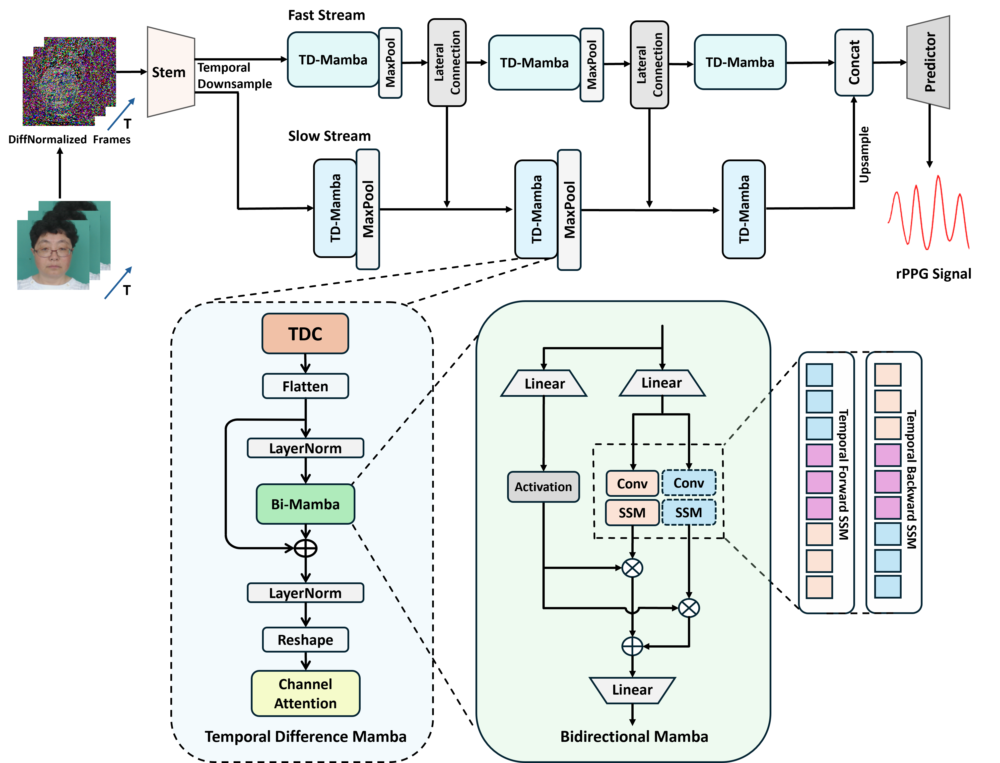

# PhysMamba

Codes of  paper **"PhysMamba: Efficient Remote Physiological Measurement with SlowFast Temporal Difference Mamba"**



## Set up 

Code is based on **[rPPG-Toolbox](https://github.com/ubicomplab/rPPG-Toolbox)**

- **Environment**

```bash
bash setup.sh
conda activate rppg-toolbox
pip install -r requirements.txt
```

- **Install causal-conv1d**

```bash
cd causal-conv1d
python setup.py install
```

- **Install Mamba**

```bash
cd Mamba
python setup.py install
```

# Datasets

* [MMPD](https://github.com/McJackTang/MMPD_rPPG_dataset)
    * Jiankai Tang, Kequan Chen, Yuntao Wang, Yuanchun Shi, Shwetak Patel, Daniel McDuff, Xin Liu, "MMPD: Multi-Domain Mobile Video Physiology Dataset", IEEE EMBC, 2023
    -----------------
         data/MMPD/
         |   |-- subject1/
         |       |-- p1_0.mat
         |       |-- p1_1.mat
         |       |...
         |       |-- p1_19.mat
         |   |-- subject2/
         |       |-- p2_0.mat
         |       |-- p2_1.mat
         |       |...
         |...
         |   |-- subjectn/
         |       |-- pn_0.mat
         |       |-- pn_1.mat
         |       |...
    -----------------

* [UBFC-rPPG](https://sites.google.com/view/ybenezeth/ubfcrppg)
    * S. Bobbia, R. Macwan, Y. Benezeth, A. Mansouri, J. Dubois, "Unsupervised skin tissue segmentation for remote photoplethysmography", Pattern Recognition Letters, 2017.
    -----------------
         data/UBFC-rPPG/
         |   |-- subject1/
         |       |-- vid.avi
         |       |-- ground_truth.txt
         |   |-- subject2/
         |       |-- vid.avi
         |       |-- ground_truth.txt
         |...
         |   |-- subjectn/
         |       |-- vid.avi
         |       |-- ground_truth.txt
    -----------------


* [PURE](https://www.tu-ilmenau.de/universitaet/fakultaeten/fakultaet-informatik-und-automatisierung/profil/institute-und-fachgebiete/institut-fuer-technische-informatik-und-ingenieurinformatik/fachgebiet-neuroinformatik-und-kognitive-robotik/data-sets-code/pulse-rate-detection-dataset-pure)
    * Stricker, R., Müller, S., Gross, H.-M.Non-contact "Video-based Pulse Rate Measurement on a Mobile Service Robot"
    in: Proc. 23st IEEE Int. Symposium on Robot and Human Interactive Communication (Ro-Man 2014), Edinburgh, Scotland, UK, pp. 1056 - 1062, IEEE 2014
    -----------------
         data/PURE/
         |   |-- 01-01/
         |      |-- 01-01/
         |      |-- 01-01.json
         |   |-- 01-02/
         |      |-- 01-02/
         |      |-- 01-02.json
         |...
         |   |-- ii-jj/
         |      |-- ii-jj/
         |      |-- ii-jj.json
    -----------------

# Train PhysMamba

